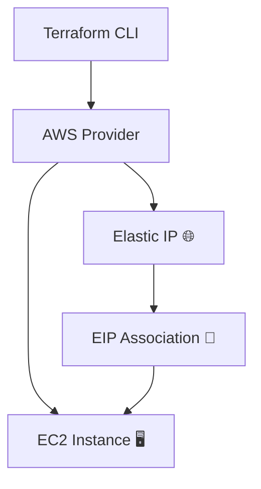

<!-- 🌟 3D Banner -->
<p align="center">
  
</p>

<!-- ⌨️ Typing Effect -->
<p align="center">
  
</p>

<!-- 🔰 Badges -->
<p align="center">
  
  
  
  
</p>

---

## 🚀 Project Overview

This project provisions an **AWS EC2 instance with an Elastic IP (EIP)** using **Terraform**.  
Elastic IP ensures a **static public IPv4 address** that remains consistent even if the EC2 instance is stopped or restarted.

The setup demonstrates **real-world AWS Infrastructure as Code (IaC)** concepts used in production environments.

---

## 🧱 Infrastructure Components

- 🖥️ AWS EC2 Instance  
- 🌐 Elastic IP (VPC scoped)  
- 🔗 Elastic IP Association with EC2  
- 🏷️ Resource tagging  
- ⚙️ Terraform AWS Provider  

---

## 📂 Project Structure

```bash
AWS_FOLDER/
├── EC2_instances/
│   ├── EC2.tf
│   └── provider.tf
├── elastic_ip/
│   ├── elastic_ip.tf
│   ├── association_eip.tf
│   ├── ec2.tf
│   ├── provider.tf
│   └── terraform.tfstate
└── README.md
```

---

## ⚙️ Key Terraform Resources

```hcl
resource "aws_eip" "lb" {
  domain = "vpc"

  tags = {
    Name = "tushar-ip"
  }
}
```

```hcl
resource "aws_eip_association" "eip_assoc" {
  instance_id   = aws_instance.example.id
  allocation_id = aws_eip.lb.id
}
```

---

## 🏗️ Architecture Flow (Conceptual)



---

## 🧪 How to Deploy

```bash
# Configure AWS credentials
aws configure

# Initialize Terraform
terraform init

# Validate configuration
terraform validate

# Preview changes
terraform plan

# Apply infrastructure
terraform apply -auto-approve

# Destroy resources (optional)
terraform destroy -auto-approve
```

---

## 🛡️ Best Practices Demonstrated

- Infrastructure as Code (IaC)
- Static public IP using Elastic IP
- Clean and readable Terraform files
- Proper tagging of AWS resources
- Ready for CI/CD pipeline integration

---

## 👨‍💻 Author

**Tushar Mishra**  
DevOps Engineer | AWS | Terraform  
📧 Email: tusharmishra2902@gmail.com  
🔗 LinkedIn: https://linkedin.com/in/tushar-mishra-02461235a  
🐙 GitHub: https://github.com/tushar-2902  

---

## 📜 License

This project is licensed under the **MIT License**.

---

<p align="center">
  
</p>
